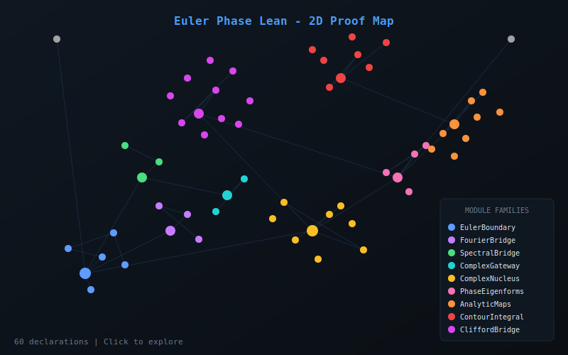
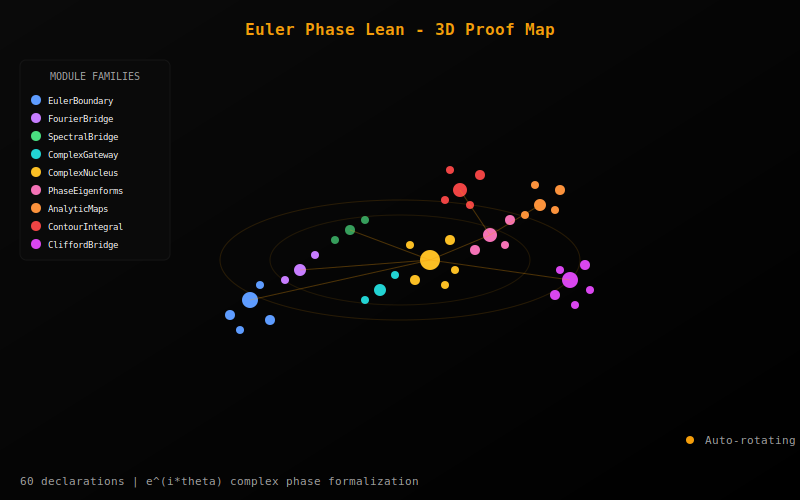

<sub><strong>Our tech stack is ontological:</strong><br>
<strong>Hardware — Physics</strong><br>
<strong>Software — Mathematics</strong><br><br>
<strong>Our engineering workflow is simple:</strong> discover, build, grow, learn & teach</sub>

---

<sub>
<strong>Notice of Proprietary Information</strong><br>
This document outlines foundational concepts and methodologies developed during internal research and development at Apoth3osis. To protect our intellectual property and adhere to client confidentiality agreements, the code, architectural details, and performance metrics presented herein may be simplified, redacted, or presented for illustrative purposes only. This paper is intended to share our conceptual approach and does not represent the full complexity, scope, or performance of our production-level systems. The complete implementation and its derivatives remain proprietary.
</sub>

---

# Euler Phase Lean

[](https://lean-lang.org/)
[](https://github.com/leanprover-community/mathlib4)
[](LICENSE)
[](RESEARCHER_BUNDLE/HeytingLean)

## Credo

> *"The imaginary unit i = sqrt(-1) is the hinge on which the whole of analysis turns."*
> — **Augustin-Louis Cauchy**

This formalization proves a unifying thesis: **the boundary of distinction is inherently complex**. The real numbers represent only the degenerate case where theta in {0, pi}. By extending Spencer-Brown's Laws of Form with Euler's formula e^(i*theta), we establish that phase eigenforms—eigenvectors of rotation with complex eigenvalue lambda = e^(i*theta)—are the natural generalization of the classical Y (marked/unmarked) eigenforms.

### Acknowledgment

We humbly thank the collective intelligence of humanity for providing the technology and culture we cherish. We do our best to properly reference the authors of the works utilized herein, though we may occasionally fall short. Our formalization acts as a reciprocal validation—confirming the structural integrity of their original insights while securing the foundation upon which we build. In truth, all creative work is derivative; we stand on the shoulders of those who came before, and our contributions are simply the next link in an unbroken chain of human ingenuity.

---

**Machine-checked formalization of the complete Ontological Mathematics framework: Euler's identity as the God Equation, the Dialectic (thesis + antithesis = 0), Occam's Razor (birthday minimization), the Principle of Sufficient Reason (nucleus invariance), and the Bloch sphere quantum model—all unified through Laws of Form and the complex nucleus R = e^(i*theta).**

<table>
<tr>
<td align="center" width="50%">
<strong>2D Proof Map</strong><br/>
<em>Click to explore: pan, zoom, search declarations</em><br/>
<a href="https://abraxas1010.github.io/euler-phase-lean/RESEARCHER_BUNDLE/artifacts/visuals/euler_phase_2d.html">
  
</a><br/>
<a href="https://abraxas1010.github.io/euler-phase-lean/RESEARCHER_BUNDLE/artifacts/visuals/euler_phase_2d.html">Open Interactive 2D Map</a>
</td>
<td align="center" width="50%">
<strong>3D Proof Map</strong><br/>
<em>Click to explore: rotate, zoom, click nodes</em><br/>
<a href="https://abraxas1010.github.io/euler-phase-lean/RESEARCHER_BUNDLE/artifacts/visuals/euler_phase_3d.html">
  
</a><br/>
<a href="https://abraxas1010.github.io/euler-phase-lean/RESEARCHER_BUNDLE/artifacts/visuals/euler_phase_3d.html">Open Interactive 3D Map</a>
</td>
</tr>
</table>

## Why This Matters

Spencer-Brown's *Laws of Form* introduces the **marked/unmarked** distinction with eigenvalues lambda = 1 (real eigenform) and lambda = -1 (anti-eigenform). But why stop at real numbers?

This formalization answers: **the boundary operator naturally extends to the complex plane**, where:
- The **Complex Nucleus** R = e^(i*theta) acts as unitary rotation
- **Phase Eigenforms** have eigenvalue lambda = e^(i*theta), continuously interpolating between marked (theta=0) and anti-marked (theta=pi)
- **Clifford algebras** Cl(2,0) provide the geometric interpretation: the bivector e1*e2 corresponds to i
- The **Euler Boundary** is the first stabilized fixed point of the nucleus—the primordial distinction

## Key Results

### The God Equation

| Theorem | Statement |
|---------|-----------|
| `euler_identity` | e^(i*pi) + 1 = 0 (Euler's identity) |
| `eulerBoundary_pi` | e^(i*pi) = -1 |
| `eulerBoundary_pi_div_two` | e^(i*pi/2) = i |

### Dialectic (Thesis + Antithesis = Synthesis)

| Theorem | Statement |
|---------|-----------|
| `zero_sum` | dialecticPair(theta).1 + dialecticPair(theta).2 = 0 |
| `oscillation_antiphase` | e^(i*(theta+pi)) = -e^(i*theta) |
| `oscillation_pair_cancel` | Thesis + antithesis cancel to zero |

### Occam's Razor (Birthday Minimization)

| Theorem | Statement |
|---------|-----------|
| `birth_eq_zero_iff` | birthday = 0 iff fixed by nucleus |
| `occam_idempotent` | Occam reduction is idempotent |
| `occam_sufficient` | Occam output satisfies PSR |
| `birth_eulerBoundary` | Euler boundary has birthday 0 |

### Principle of Sufficient Reason (PSR)

| Theorem | Statement |
|---------|-----------|
| `sufficient_iff` | Sufficient R a iff R a = a (nucleus invariance) |
| `sufficient_eulerBoundary` | Euler boundary satisfies PSR |
| `minimal_reason_exists` | Every x has a sufficient reason above it |
| `sufficient_reachable` | Sufficient reasons are stable under evolution |

### Euler Boundary Layer

| Theorem | Statement |
|---------|-----------|
| `eulerBoundary_periodic` | e^(i*(theta + 2*pi)) = e^(i*theta) |
| `eulerBoundary_add` | e^(i*(theta1 + theta2)) = e^(i*theta1) * e^(i*theta2) |
| `norm_eulerBoundary` | norm(e^(i*theta)) = 1 |
| `eulerBoundary_isLeast` | Euler boundary is minimal nontrivial fixed point |

### Laws of Form Nucleus

| Theorem | Statement |
|---------|-----------|
| `Reentry.idempotent` | R(R(a)) = R(a) |
| `Reentry.le_apply` | a <= R(a) (closure) |
| `Reentry.map_inf` | R(a meet b) = R(a) meet R(b) |
| `process_inf_counter` | Process meet counter-process = bottom |

### Complex Nucleus Layer

| Theorem | Statement |
|---------|-----------|
| `action_comp` | R_theta1 compose R_theta2 = R_(theta1+theta2) |
| `action_norm` | norm(R_theta(z)) = norm(z) (unitarity) |
| `action_pi` | R_pi(z) = -z (negation) |
| `action_two_pi` | R_(2*pi) = id (periodicity) |

### SKY Combinators

| Theorem | Statement |
|---------|-----------|
| `K_step` | K x y -> x (projection/forgetful) |
| `S_step` | S x y z -> x z (y z) (distribution) |
| `Y_step` | Y f -> f (Y f) (reentry/fixed-point) |
| `I_reduces` | S K K reduces to identity |
| `combToLoF` | K=unmark, S=mark, Y=reentry |

### Bloch Sphere (Quantum Layer)

| Theorem | Statement |
|---------|-----------|
| `poisson_is_su2` | Coordinate brackets match su(2) |
| `gateX_involutive` | X gate is involutive |
| `gateH_involutive` | Hadamard is involutive |
| `logicParameter_gateZ` | Logic parameter preserved by Z |

### Clifford-Complex Bridge

| Theorem | Statement |
|---------|-----------|
| `rotor_is_phase` | Unit-norm Cl2Rep corresponds to e^(i*theta) |
| `spinor_phase_correspondence` | Rotor action = phase eigenform action |

## Architecture

```
HeytingLean/
|-- LoF/                             # Laws of Form Layer
|   |-- PrimaryAlgebra.lean         # Frame-based LoF base
|   |-- Nucleus.lean                # Reentry nucleus, Euler boundary, Omega
|   +-- Combinators/
|       |-- SKY.lean                # SKY combinator calculus
|       +-- Heyting/
|           +-- CombinatorMap.lean  # K=unmark, S=mark, Y=reentry
|
|-- Epistemic/                       # Epistemic Layer
|   +-- Occam.lean                  # Birthday, breathe, occam operators
|
|-- Logic/                           # Logic Layer
|   +-- PSR.lean                    # Principle of Sufficient Reason
|
|-- Analysis/                        # Euler Boundary Layer
|   |-- EulerBoundary.lean          # e^(i*theta) + God Equation
|   |-- EulerFourierBridge.lean     # Fourier coefficient connection
|   |-- EulerSpectralBridge.lean    # Spectral measure integration
|   +-- EulerComplexGateway.lean    # Complex gateway abstraction
|
|-- Complex/                         # Complex Analysis Layer
|   |-- ComplexNucleus.lean         # R = e^(i*theta) rotation action
|   |-- PhaseEigenforms.lean        # lambda = e^(i*theta) eigenforms
|   |-- AnalyticMaps.lean           # Holomorphic + RotationCompatible
|   |-- ContourIntegral.lean        # Circle integrals + Cauchy formula
|   +-- CliffordComplexBridge.lean  # Cl(2,0) to C correspondence
|
|-- Ontology/                        # Philosophical Bridge Layer
|   |-- Monadology.lean             # Ontological Mathematics mapping
|   +-- Primordial.lean             # Dialectic, zero_sum, oscillation
|
|-- Quantum/                         # Quantum Layer
|   +-- LoFBloch.lean               # Bloch sphere with LoF coordinates
|
+-- Tests/                           # Sanity Tests
    |-- Analysis/EulerBoundarySanity.lean
    +-- Complex/ComplexAnalysisSanity.lean
```

## Verification

```bash
cd RESEARCHER_BUNDLE

# Install dependencies (first time only)
lake update

# Build and verify
lake build --wfail

# Check for sorry/admit
grep -rn "sorry\|admit" HeytingLean/*.lean HeytingLean/**/*.lean && echo "FAIL" || echo "PASS: No sorry/admit found"
```

## Mathematical Background

### The Complexified Boundary Thesis

In *Laws of Form*, the Y eigenform satisfies Y = not(Y), which implies Y = i (paradox). Our formalization resolves this:

1. **Real eigenforms**: lambda in {1, -1} correspond to theta in {0, pi}
2. **Complex eigenforms**: lambda = e^(i*theta) for any theta in [0, 2*pi)
3. **The paradox Y = not(Y)**: Resolved at theta = pi/2 where lambda = i

### The Euler Boundary as First Stabilized Point

The nucleus R : A -> A is a closure operator on a frame (locale). The **Euler boundary** is defined as:

```
eulerBoundary = inf { x in Omega_R | bottom < x and x <= support }
```

This is the **minimal nontrivial fixed point**—the first stabilized distinction that emerges from the primordial void.

### Dialectic: Process and Counter-Process

Every reentry nucleus generates a **complementary pair**:
- **Process** (primordial): The Euler boundary itself
- **Counter-process**: Its orthogonal complement

These satisfy `process meet counter = bottom` and together span the space of distinctions.

### Occam's Razor as Birthday Minimization

The **birthday** of an element is the minimal number of nucleus applications needed to stabilize:

```
birth(a) = min { n | breathe^(n+1)(a) = breathe^n(a) }
```

**Occam's Razor** selects the explanation with minimal birthday—the simplest fixed point that contains the observation.

### Principle of Sufficient Reason

An element is **sufficient** iff it is invariant under the nucleus:

```
Sufficient R a <-> R a = a
```

This formalizes Leibniz's PSR: every truth has a sufficient reason, and that reason is a fixed point of the explanatory nucleus.

### Clifford Geometric Interpretation

The 2D Clifford algebra Cl(2,0) has:
- Scalar part (grade 0): real numbers
- Bivector part (grade 2): generated by e1*e2 with (e1*e2)^2 = -1

The map `a + b*(e1*e2) -> a + b*i` establishes the correspondence, and "rotors" (unit-norm elements) are exactly the phases e^(i*theta).

### Bloch Sphere and LoF States

The Bloch sphere model uses LoF coordinates (j, k, mark):
- **void** = (0, 0, 1) = |0> (north pole, unmarked)
- **mark** = (0, 0, -1) = |1> (south pole, marked)
- **reentry** = (1, 0, 0) = |+> (equator, superposition)

The su(2) Lie algebra structure emerges from the Poisson bracket on these coordinates.

### Ontological Mathematics Correspondence

This formalization provides machine-checked proofs for the mathematical framework underlying **Ontological Mathematics** (Pythagorean Illuminati tradition, cf. Mike Hockney's "God Series").

| Ontological Mathematics | HeytingLean | Module |
|------------------------|-------------|--------|
| **Monad** (dimensionless soul) | `ComplexNucleus` | `Ontology/Monadology.lean` |
| **God Equation** e^(i*pi)+1=0 | `euler_identity` | `Analysis/EulerBoundary.lean` |
| **Dialectic** (thesis+antithesis=0) | `zero_sum` | `Ontology/Primordial.lean` |
| **PSR** (sufficient reason) | `Sufficient` | `Logic/PSR.lean` |
| **Occam's Razor** | `occam`, `birth` | `Epistemic/Occam.lean` |
| **Euler Boundary** | `eulerBoundary` | `LoF/Nucleus.lean` |
| **Frequency Domain** | Unit circle in C | `FrequencyDomain` |
| **Spacetime Domain** | Real projection {1, -1} | `SpacetimeDomain` |
| **Soul-Body Docking** | Fourier transform | `EulerFourierBridge.lean` |
| **Rotor/Spinor** | `Cl2Rep` + `rotor_is_phase` | `CliffordComplexBridge.lean` |
| **SKY Combinators** | K=unmark, S=mark, Y=reentry | `Combinators/` |
| **Bloch Sphere** | `LoFState` | `Quantum/LoFBloch.lean` |

**Key insight**: The marked/unmarked distinction (Boolean logic) is the *degenerate* case theta in {0, pi}. The full monad operates in the complex frequency domain with arbitrary phase theta in [0, 2*pi). Material reality is the Fourier projection of frequency-domain monads.

## References

1. Spencer-Brown, G. (1969). *Laws of Form*. Allen & Unwin.
2. Cauchy, A.-L. (1825). *Memoire sur les integrales definies*. Academie des Sciences.
3. Hestenes, D. (1984). *Clifford Algebra to Geometric Calculus*. D. Reidel.
4. Hockney, M. et al. *The God Series*. (Ontological Mathematics / Pythagorean Illuminati).
5. Leibniz, G.W. (1714). *Monadology*.
6. Mathlib Contributors. *Mathlib4*. https://github.com/leanprover-community/mathlib4

## License

MIT License - See [LICENSE](LICENSE) for details.

---

<p align="center">
Part of <a href="https://github.com/Abraxas1010/heyting">HeytingLean</a> | <a href="https://apoth3osis.io">apoth3osis.io</a>
</p>
